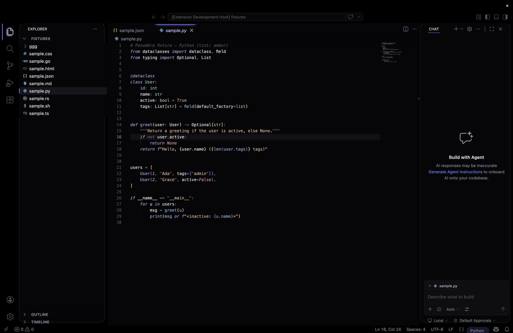
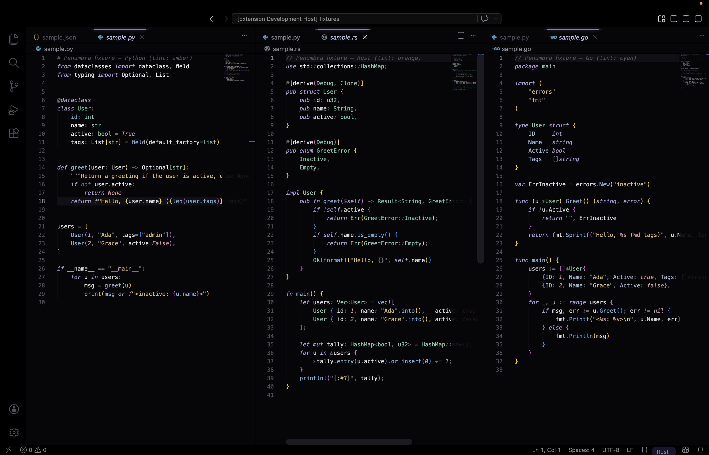

# Penumbra

Penumbra is a pitch-black VS Code color theme with optional Custom UI Style chrome for rounded floating workbench surfaces and per-language accent tints.

## Screenshots

### Workbench



### Syntax



More screenshots can live in `assets/screenshots/`:

- `theme-only.png` - optional screenshot with only the color theme enabled
- `custom-ui.png` - optional screenshot with Custom UI Style enabled

## Features

- OLED-friendly dark color theme
- Generated color theme from `tokens.json`
- Optional rounded UI layer through `subframe7536.custom-ui-style`
- Language-aware accent tinting for tabs, status bar chips, scrollbars, and selected sidebar rows
- Sandbox development launcher for testing without changing your main VS Code profile

## Install For Development

```sh
./install.sh
```

Then add the printed settings to your VS Code `settings.json` and run:

```text
Custom UI Style: Reload
```

## Sandbox Development

```sh
./scripts/dev.sh
```

Useful options:

```sh
./scripts/dev.sh --reset
./scripts/dev.sh --no-css
./scripts/dev.sh --no-launch
```

CSS and JavaScript changes require `Custom UI Style: Reload`. Token and theme changes require a window reload.

## Build And Validate

```sh
npm run build
npm run check
```

`npm run build` regenerates:

- `themes/penumbra-color-theme.json`
- `css/_tokens.generated.css`

`npm run check` fails if generated files are missing or stale.

## Package

```sh
npm run package
```

This requires `vsce` on your `PATH`.

## Custom UI Style Imports

Use the generated tokens first, then the handwritten CSS and JS:

```jsonc
"custom-ui-style.external.imports": [
  "file:///absolute/path/to/penumbra/css/_tokens.generated.css",
  "file:///absolute/path/to/penumbra/css/penumbra.css",
  "file:///absolute/path/to/penumbra/css/penumbra.js"
]
```

## Uninstall

```sh
./uninstall.sh
```

Use `./uninstall.sh --purge` to also remove Custom UI Style.
